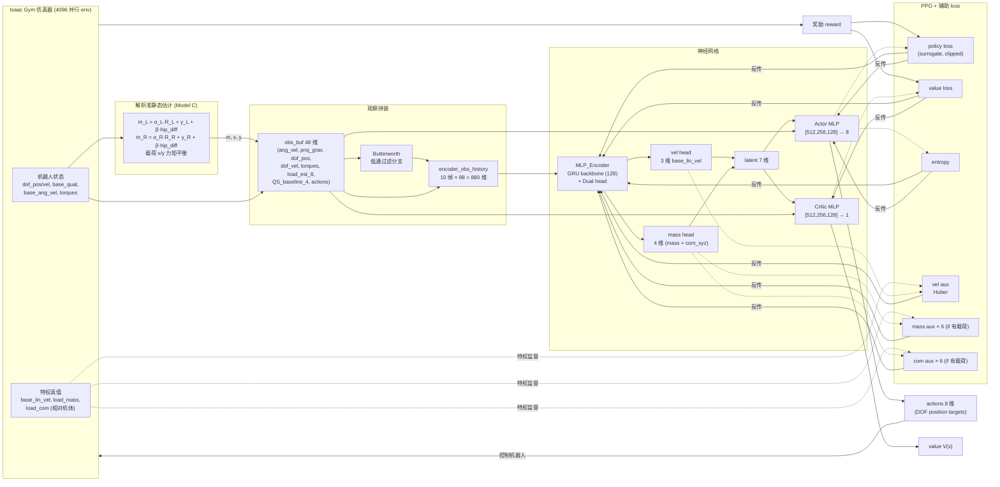
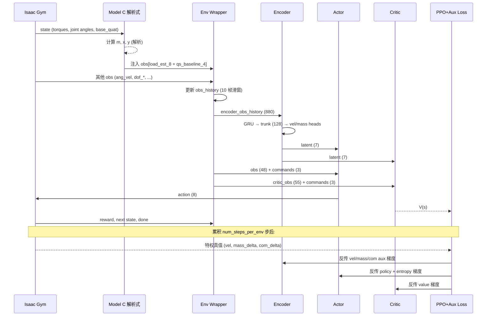

# 网络架构与训练流程

**目的**：为论文整理本系统的网络输入/输出、训练数据流、损失函数构成。

---

## 1. 总览（Mermaid 流程图）



---

## 2. 观察 (Observation) 分解

实际跑训练时机器人看到的 obs 是这样组装的（[wheelfoot_flat.py:294-303](../legged_gym/envs/wheelfoot_flat/wheelfoot_flat.py#L294-L303)）：

| 序号 | 字段 | 维度 | 来源 | 说明 |
|---|---|---|---|---|
| 1 | `base_ang_vel` | 3 | IMU 直接读 | 机体角速度（body frame） |
| 2 | `projected_gravity` | 3 | 姿态计算 | 重力向量在机体系下投影 |
| 3 | `dof_pos − default` | 6 | 编码器 | 关节角度（去基准） |
| 4 | `dof_vel` | 8 | 编码器 | 关节角速度 |
| 5 | `torques` | 8 | 力矩传感 | 8 个关节扭矩 |
| 6 | **`load_estimation_obs`** | **8** | **Model C 解析** | `m, x, y, present, sin/cos lieangle L/R` |
| 7 | **`load_residual_baseline_obs`** | **4** | **Model C 解析** | `qs_mass_delta, qs_com_delta (xyz)` |
| 8 | `actions` (前一步) | 8 | RL | 上一步动作 |
| **合计** | | **48** | | = `num_observations` |

**关键点**：序号 6 和 7 是**Model C 解析公式的输出**，作为先验注入到 RL 观察里。

**critic 额外的特权信息**（[wheelfoot_flat.py:308-316](../legged_gym/envs/wheelfoot_flat/wheelfoot_flat.py#L308-L316)）：critic_obs = critic_extra (7) + obs_buf (48) = **55 维**，extra 包含 `base_lin_vel` 等只有特权访问能看到的量。

---

## 3. Encoder 详细架构

### 3.1 输入

```
encoder_obs_history ∈ R^880
  = stack 10 frames of (obs_buf + filtered_obs_buf)
  ≈ 10 × (48 + 40)
```

[wheelfoot_flat.py:263-264](../legged_gym/envs/wheelfoot_flat/wheelfoot_flat.py#L263-L264) 维护一个滑动窗口，每步把最老的丢掉、最新的加进去。

### 3.2 结构（[mlp_encoder.py:120-176](../legged_gym/algorithm/mlp_encoder.py#L120-L176)）

```
                      encoder_obs_history (880)
                              │
              ┌───────────────┴───────────────┐
              ▼  reshape to (10, 88)          │
       ┌─────────────┐                        │
       │  GRU (1-layer)  hidden 128           │
       │  (num_layers = max(1, len(hidden_dims)-1)) │
       └─────────────┘                        │
              │  取最后时间步                  │
              ▼                               │
        trunk (128)                           │
        │       │                             │
        ▼       ▼                             │
   vel_head    mass_head                      │
   [64]→3      [64]→4                         │
        │       │                             │
        └───┬───┘                             │
            ▼                                 │
       latent (7 = 3 vel + 4 mass)            │
```

| 输出维度 | 维度 | 含义 |
|---|---|---|
| `vel_x, vel_y, vel_z` | 3 | 估计的机体线速度（监督目标：`base_lin_vel`） |
| `mass_delta` | 1 | 估计的"载荷引起的机体质量增量" |
| `com_dx, com_dy, com_dz` | 3 | 估计的"载荷引起的总 CoM 偏移" |

### 3.3 监督目标

特权真值来自 [wheelfoot_flat.py:1354-1365](../legged_gym/envs/base/base_task.py#L1354-L1365)（在 `base_task` 里基于仿真器真实状态计算）：
- `vel_truth = base_lin_vel`
- `mass_truth = m_eff - body_mass`（载荷加上来的部分）
- `com_truth = com_eff - body_com0`（载荷引起的 CoM 偏移）

---

## 4. Actor / Critic 详细架构

| 网络 | 输入 | 维度 | 隐层 | 输出 |
|---|---|---|---|---|
| **Actor** | `[latent, obs_buf, commands]` | 7 + 48 + 3 = 58 | [512, 256, 128] | 8 维动作 (DOF 位置目标) |
| **Critic** | `[latent, critic_obs, commands]` | 7 + 55 + 3 = 65 | [512, 256, 128] | 1 维 value |

激活函数：ELU。Actor 输出加可学习 `logstd` 作为高斯策略的方差（[actor_critic.py:118](../legged_gym/algorithm/actor_critic.py#L118)）。

---

## 5. 训练损失构成

PPO 的标准 3 项 + encoder 辅助 3 项，统一反向传播：

| 损失项 | 形式 | 系数 | 监督来源 |
|---|---|---|---|
| 策略 surrogate loss | clipped ratio | 1.0 | 优势函数 (GAE) |
| value loss | (MSE, clipped) | 1.0 | reward + γ·V(s') |
| entropy | −H(π) | 0.01 | 策略本身 |
| **vel aux** | Huber(δ=0.01) | 1.0 | 特权真值 `base_lin_vel` |
| **mass aux** | Huber(δ=0.01) | 2.0 × (×6 if 载荷在体) | 特权真值 `mass_delta` |
| **com aux** | Huber(δ=0.01) | 6.0 × (×6 if 载荷在体) | 特权真值 `com_delta` |

**关键设计 (`extra_loss_load_boost = 6.0`)**：当 episode 中确实有载荷被检测在机体上时，`mass aux` 和 `com aux` 的权重再放大 6×（[wheelfoot_flat_config.py:449](../legged_gym/envs/wheelfoot_flat/wheelfoot_flat_config.py#L449)）。无载荷时不放大——避免让网络在 0 载荷时输出强烈先验。

---

## 6. 数据流（一步训练）



每次 iteration：
1. 跑 `num_steps_per_env` 步 rollout（4096 envs 并行）
2. 计算 GAE 优势函数
3. `num_learning_epochs=5` 个 epoch × `num_mini_batches=4`，对所有网络做更新
4. 更新 noise schedule + KL adaptive 学习率

---

## 7. 论文叙述要点（建议）

**网络层面可以强调的点**：

1. **混合先验**：解析 Model C 输出作为 obs 显式注入 (`load_estimation_obs`, `load_residual_baseline_obs`)。Encoder 不需要从零学 QS 假设下的物理映射，专注于学剩余部分。

2. **特权监督**：encoder 同时学速度、载荷质量、载荷 CoM 三个监督目标。特权真值只在训练时可用，部署时 encoder 用 RL obs 推断（典型的 student-teacher 范式）。

3. **载荷敏感加权**：辅助 loss 的 `load_boost = 6×` 让网络对"有载荷"工况下的估计精度做强约束，又不在零载荷时强行学先验。

4. **GRU backbone**：obs history (10 帧) 让 GRU 自然吸收时序信息（关节加速度、机体角加速度等动态量），不需要显式输入加速度。

5. **解耦头**：`vel` 和 `mass+com` 分两个 head（dual head），共享 GRU trunk 但各自有独立的 head MLP（[64]→3 或 [64]→4），避免任务间梯度互相干扰。配置里也保留了"层级头" 选项 (`use_hierarchical_com_estimation`)：让 com 头额外吃 mass 头的预测作为输入，并通过 `com_use_mass_detach` 控制是否把梯度回传到 mass 头；当前训练用的是 dual head，没启用层级。

**与"纯 NN"或"纯解析"baseline 对比的论证逻辑**：

- 纯解析 Model C：mass RMSE 0.77 kg，已被证明是 5 参数线性公式天花板
- 纯 NN（不喂解析输出）：encoder 要从零学 QS 物理 → sample efficiency 低
- 解析 + NN（你的方法）：encoder 接收 QS 估计作为强先验，专注学动态/非线性残差

---

**附**：核心维度速查表

| 量 | 维度 | 出处 |
|---|---|---|
| `num_observations` | 48 | config L37 |
| `num_critic_observations` | 55 | config L38 |
| `num_actions` | 8 | config L40 |
| `obs_history_length` | 10 | config L45 |
| `encoder num_input_dim` | 880 | config L392 |
| `encoder num_output_dim` | 7 (3 vel + 1 mass + 3 com) | config L393 |
| `encoder backbone` | GRU 2-layer, hidden 128 | config L394 |
| `actor input` | 58 (7+48+3) | runner L69 |
| `critic input` | 65 (7+55+3) | runner L60 |
| `num_envs` | 1024 | config L36 |
| `num_steps_per_env` | （查 runner 配置） | — |
